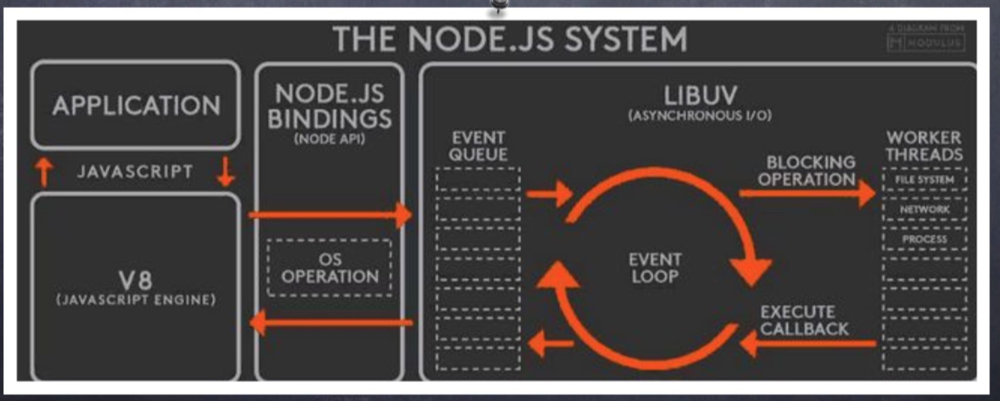

# 大规模 Node.js 项目架构与优化

为什么要选择 node 做一个中间层：

* node 可以消减 api 多余数据
* node 可以做 ssr
* node 更好的前后端分离与**独立上线**，如果没有中间层，前端直接连接 `java 或者 php`，耦合性高
* 不用 node ,一个前端刚入职就被要求装什么 `apache` `tomcat` ，装不上还被鄙视
* node 是基于异步的，吞吐量 大型聊天应用

怀疑 `node` 不稳定？容易崩？ 哪里就不稳定了？怎么就容易崩了？凭什么不能用呢？因为单线程（只要把容错做好，永远不会崩）？

`node` 不是说替代谁，而是 中间层 ，降低前后端耦合度

只做页面的叫**页面仔**，只写组件的叫**组件仔**，写组件+node的才叫真正的**前端**

京东的 `taro`

 ### NodeJS异步IO原理浅析及优化方案

#### 异步IO的是与非

* 前端通过异步IO可以消除UI堵塞
* 假设请求资源A的时间是M，请求资源B的时间为N，那么同步的请求耗时为：M+N，如果采用异步方式占用时间为Max(M,N)
* 随着业务的复杂，会引入分布式系统，时间会线性增加，M+N+…和Max（M,N,…），这会放大同步和异步之间的差异
* I/O是昂贵的，分布式I/O是更昂贵的
* NodeJs 适用于IO密集型不适用CPU密集型

| I/O类型 | 花费的CPU时钟⏲️周期 |
| ------ | ------ |
| CPU 一级缓存 | 3 |
| CPU 二级缓存 | 14 |
| 内存 | 250 |
| 硬盘 | 41000000 |
| 网络 | 240000000 |

一个CPU时钟周期： `1/cpu主频`：如：`1/2.7 GHz`
#### Node对异步IO的实现



异步IO是操作系统做的，NodeJs是单线程的，LIBUV是辅助 NodeJs进行 eventloop 的，LIBUV 封装了📦这么一套回调机制

CPU满了是因为并发🈵️了，内存🈵️了是因为变量，内存泄露等原因

#### 几个特殊的API

macrotask 和 microtask

使用`setImmediate`的时候万万要注意版本，不同版本是不同的，以下代码是在 `node`环境下面运行的，在浏览器下是没有 `setImmediate` 和 `process.nextTick`

> 同步>nextTick>micratask>macratask，这几个是不走 event-loop的

```javascript
setTimeout(function() {
  console.log(1);
}, 0);
setImmediate(function() {
  console.log(2);
});
process.nextTick(() => {
  console.log(3)
});
new Promise((resovle, reject) => {
  console.log(4);
  resovle(5);
}).then(function() {
  console.log(5);
});
console.log(6);
//4 6 3 5 1 2
```

用node去实现一个 sleep

```javascript
async function test() {
    console.log('Hello');
    await sleep(1000);
    console.log('world!');
}
function sleep(ms) {
	return new Promise(resolve => setTimeout(resolve, ms)); 
}
```

#### 常用的Node控制异步API的技术手段

* Step、wind（提供等待的异步库）、Bigpipe、Q.js
* Async\Await
* Promise/Defferred 是一种先执行异步调用，延迟传递的处理方式。Promise 是高级接口，事件是低级接口。低级接口可以构建更多复杂的场景，高级接口一旦定义，不太容易变化，不再有低级接口的灵活性，但对于解决问题非常有效
* 由于 Node 基于V8的原因，目前还不支持协程。协程不是进程和线程，其执行过程更类似于子例程，或者说不带返回值的函数调用。
* 一个程序可以包含多个协程，可以对比与一个进程包含多个线程，因而我们来比较下协程和线程。多个线程是相对独立的，有自己的上下文，切换受系统控制。而协程也相对独立，有自己的上下文，但是其切换由自己控制，由当前协程切换到其他协程由当前协程来控制

#### V8垃圾回收机制

* Node 使用 JavaScript 在服务端操作大内存的对象时受到了一定的限制，64位系统下约为1.4G，32位系统下为 0.7G

* node  中查看内存的方式： `process.memoryUsage();` 可以看这里 [Js 中的内存泄漏-基于Node.js环境](https://github.com/LiuHao713/task/blob/master/Js%20memory%20leak.md)

* V8 的垃圾回收策略主要是基于**分代式垃圾回收机制**，V8 中内存分为新生代和老生代两代，新生代为存活时间较短对象，老生代中为存活时间较长的对象。