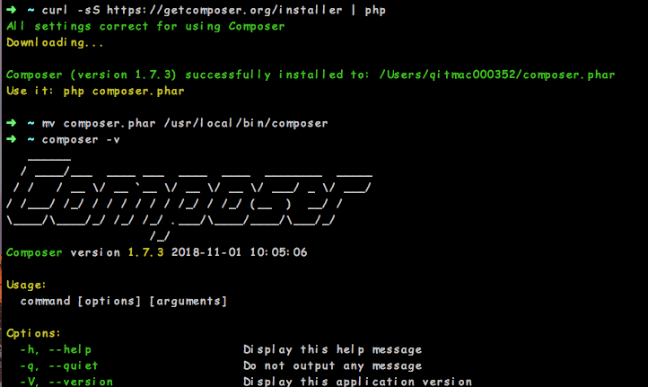
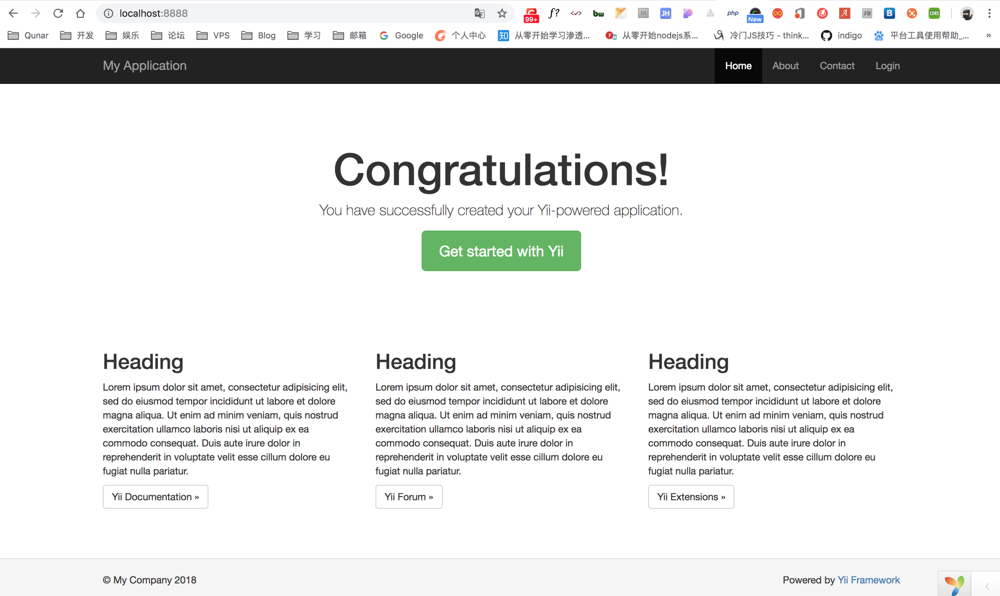

# Mac 下安装YII

### 安装Composer方式

在 Linux 和 Mac OS X 中，你可以运行如下命令：

```
curl -sS https://getcomposer.org/installer | php
mv composer.phar /usr/local/bin/composer
```
将composer.phar移动到 /usr/local/bin/composer支持全局访问composer命令
验证: `composer -v`


### 安装Yii2
安装 Composer 后，您可以通过在 Web 可访问的文件夹下运行以下命令来 安装Yii应用程序模板：

```
composer create-project --prefer-dist yiisoft/yii2-app-basic basic
```

这将在一个名为 `basic` 的目录中安装Yii应用程序模板的最新稳定版本。 如果需要，您可以选择不同的目录名称。


出现以上界面就代表安装成功了

### 验证 yin 安装结果

当在项目 `web` 目录下可以通过下面的命令:

```
php yii serve
```

默认情况下Https-server将监听8080。可是如果这个端口已经使用或者你想通过这个方式运行多个应用程序，你可以指定使用哪些端口。 只加上 --port 参数：

```
php yii serve --port=8888
```

安装完成后，就可以使用浏览器通过如下 URL 访问刚安装完的 Yii 应用了：

```
http://localhost:8888
```

出现以下界面就代表成功了


### 应用结构
应用中最重要的目录和文件（假设应用根目录是 basic）：
```
basic/                  应用根目录
    composer.json       Composer 配置文件, 描述包信息
    config/             包含应用配置及其它配置
        console.php     控制台应用配置信息
        web.php         Web 应用配置信息
    commands/           包含控制台命令类
    controllers/        包含控制器类
    models/             包含模型类
    runtime/            包含 Yii 在运行时生成的文件，例如日志和缓存文件
    vendor/             包含已经安装的 Composer 包，包括 Yii 框架自身
    views/              包含视图文件
    web/                Web 应用根目录，包含 Web 入口文件
        assets/         包含 Yii 发布的资源文件（javascript 和 css）
        index.php       应用入口文件
    yii                 Yii 控制台命令执行脚本
```
一般来说，应用中的文件可被分为两类：在 basic/web 下的和在其它目录下的。 前者可以直接通过 HTTP 访问（例如浏览器），后者不能也不应该被直接访问。
models 目录包含了所有模型类， views 目录包含了所有视图脚本， controllers 目录包含了所有控制器类。

每个应用都有一个入口脚本 web/index.php，这是整个应用中唯一可以访问的 PHP 脚本。 入口脚本接受一个 Web 请求并创建应用实例去处理它。 应用在它的组件辅助下解析请求， 并分派请求至 MVC 元素。视图使用小部件 去创建复杂和动态的用户界面。
以下图表展示了一个应用如何处理请求：

### 创建新的页面
* 视图层写在 views／site下面：

  * 对应关系如：`http://localhost:8888/index.php?r=site/say` 对应于 `/views/site/say.php` 

* 控制器写在 controllers/ 下面：
  * 在SiteControlloer.php 里面加一个 action：
  * ```
    public function actionSay($message = 'Hello 风车车')
    {
        return $this->render('say', ['message' => $message]);
    }
    ```

* 这样子，当我们路由为`http://localhost:8888/index.php?r=site/say`时，就会先进入actionSay 控制器，控制器给 view 注入变量：`$message` 给 say.php 模板

* say.php 里面使用注入过来的变量：

* ```php
  <?php
  use yii\helpers\Html;
  ?>
  <?= Html::encode($message) ?>
  ```

* 刷新页面，就出来效果了


以上是关于 基本模板的安装，如果想使用高级模板，可以看这里 [点我](https://github.com/yiisoft/yii2-app-advanced/blob/master/docs/guide-zh-CN/start-installation.md)

* 第一步：安装包 ：`composer create-project --prefer-dist yiisoft/yii2-app-advanced advance-bms`
* 第二步：在项目下面 执行 `php init` 选择 0 开发模式

#### 命令行操作 mysql

* 登陆：`mysql -u root -p`
* 查看数据库：`show databases;`
* 使用某一个数据库： `use databaseName;`
* 查看数据表：`show tables;`
* 查看mysql 版本： `select version();`