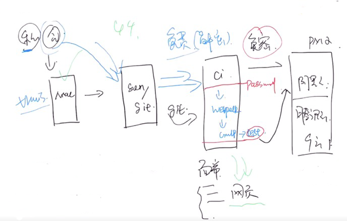

# 从0到大论前端持续集成

### 什么是持续集成（Continuous integration）

> 在持续集成环境🀄️，开发人员将会频繁的提交代码到主干。这些新提交在最终合并到主干之前，都需要通过编译（webpack rollup）和自动化测试流进行验证。这样做是基于之前持续集成过程中很重视自动化测试验证结果，以保障所有的提交在合并主干之后的质量问题，对可能出现的一些问题进行预警。

理解为一台机器，能监听到我们往git上提交代码，能帮助我们去跑我们的自动化测试流程

#### 持续集成需求

* 持续集成是通过平台串联各个开发环节，实现和沉淀工作自动化的方法
* 线上代码和代码仓库不同步，影响迭代和团队协作
* 静态资源发布依赖人工，浪费开发人力
* 缺少自动化测试，产品质量得不到保障
* 文案简单修改上线，需要技术介入

### 持续交付（CONTINUOUS DELIVERY）

> 持续交付就是讲我们的应用发布出去的过程。这个过程可以确保我们尽可能快的实现交付。这就意味着除了自动化测试，我们还需要有自动化的发布流，以及通过一个按键就可以随时随地实现应用的部署上线。
>
> 通过持续交付，我们可以决定每天，每周，每两周发布一次，这完全可以根据自己的业务进行设置。
>
> 但是，如果你真的希望体验持续交付的优势，就需要先进行小批量发布，尽快部署到生产线，以便在出现问题时方便进行故障排除

### 持续部署（CONTINUOUS DEPLOYMENT）

> 如果我们想更加深入一步的话，就是持续部署了。通过这个方式，任何修改通过了所有已有的工作流就会直接和客户见面。没有人为干预（没有一键部署按钮），只有当一个修改在工作流中构建失败才能阻止它部署到产品线
>
> 持续部署时一个很优秀的方式，可以加快与客户的反馈循环，但是会给团队带来压力，因为不再有"发布日"了。开发人员可以专注于构建软件，他们看到他们的修改在他们完成工作后几分钟就上线了。基本上，当开发人员在主分支中合并一个提交时，这个分支将被构建、测试，如果一切顺利，则部署到生产环境中
>
> 也就是适合小的创业公司（有试错成本小），在构建的过程中一路飘绿色，要求自动化的case的覆盖要全。在大的公司一般没有用到， 出了问题影响太大

> dev ops 要比ci cd更大

稍作解释： 

* 这里一共有四台机器，第一台是我们的本地开发的Mac机器，第二台是 `svn` 或者 `git`代码仓库，第三台是运行`webpack、gul、 自动化测试case`的`ci` 平台，第四台是我们的服务器运行 `pm2 node`
* `ci` 平台有钩子，可以监控到我们往git提交代码的动作，会自动的去git拉取代码，跑webpack gulp test，接着ci 平台和 服务器之间是配了免密登陆的，可以借助脚本往服务器传代码
* 本地会生成一对密钥对，用于ci平台和服务器之间免密

### Travis Ci

### Jenkins

### 什么是统一代码仓库

### 什么是前端工程化

### 什么是自动化构建

### 解放劳动力更多的自动化

