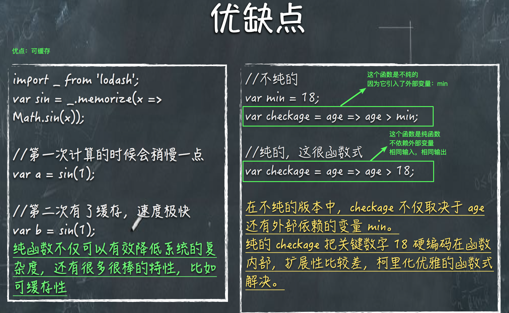

# 函数式编程

* 函数是一等公民，所谓一等公民指的是与其他数据类型一样，处于同等地位，可以赋值给其他变量、也可以作为参数传给另一个函数、或者作为别的函数的返回值
* 在函数式编程中，变量是不能被修改的，所有的变量只能被赋值一次
* 总结函数式编程的特点：
  * 函数是`一等公民`（就是所有变量里面的贵族，优先考虑函数）
  * 只用`表达式` ，不用`语句`，在函数式编程里面没有 `if else switch try catch ` 等，是用数学的思维去解决问题
  * 没有副作用、不修改状态、引用透明（函数运行只考参数）

#### 纯函数

* 对于相同的输入，永远得到相同的输出

* 没有任何可观察的副作用，不依赖外部环境状态

* ```javascript
  var a = [12, 5, 8, 1, 2, 3];
  //Array.slice 是纯函数，因为它没有副作用，并且对于相同的输入总能得到相同的输出
  a.slice(0, 3);
  a.slice(0, 3);
  a.slice(0, 3);
  a.slice(0, 3);
  //Array.splice 就不是纯函数，它修改了原来的数组，并且每次相同的输入会得到不同的输出
  ```

* `map` 和 `reduce` 就是标准的 纯函数



#### 幂等性

* 幂等性是指 函数执行无数次后还具有相同的效果，对于同一个参数，函数运行一次和运行两次结果一致

```javascript
Math.abs(-12);// 这就符合 幂等性
```

#### 柯里化

* 柯里化 是将**接受多个参数的函数变成 只接受一个参数的函数**，其实是将参数存起来

* ```javascript
  // 比如上图中的 函数 checkage 
  var checkage18 = min => (age => age > min);
  ```

* 